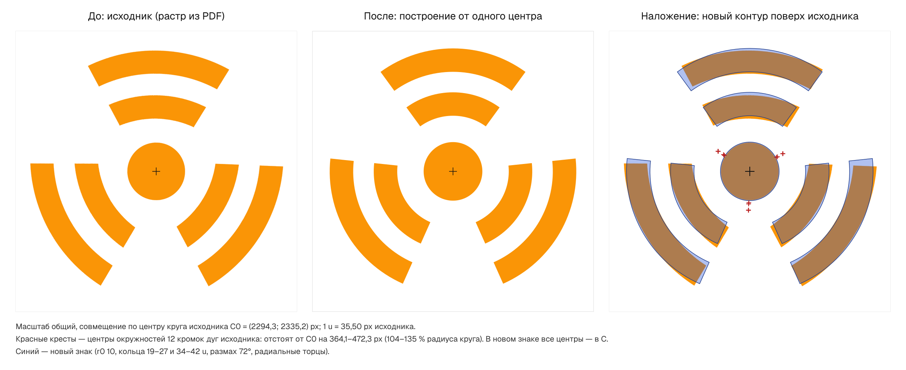
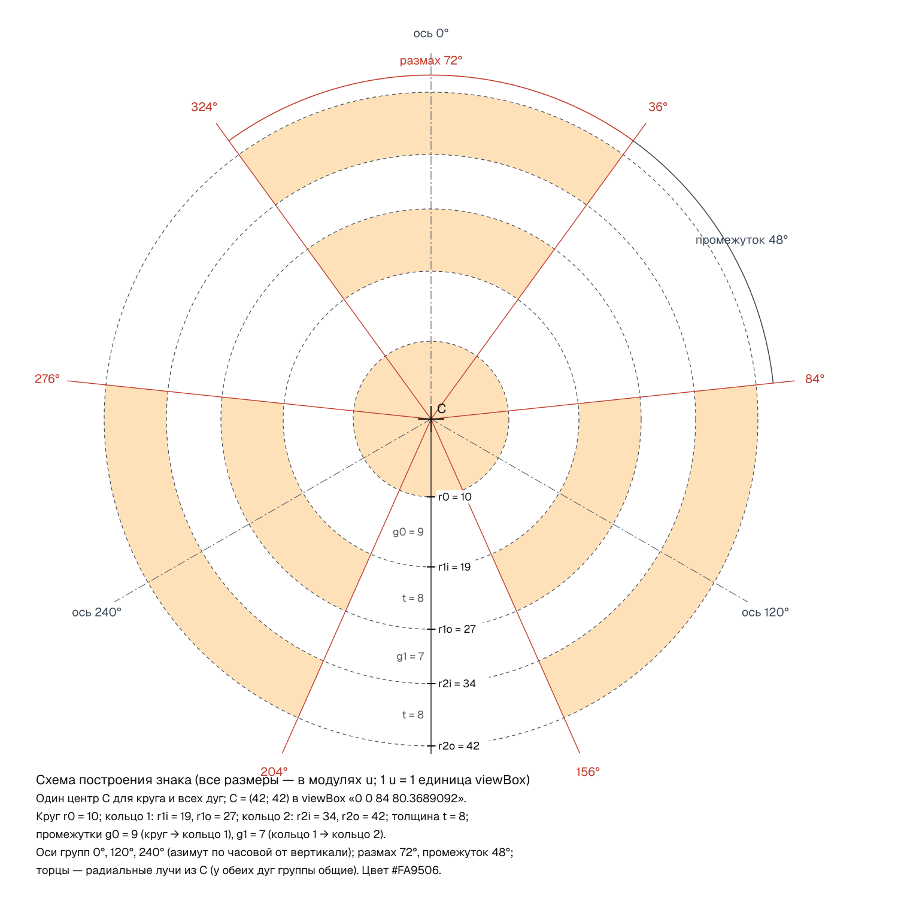
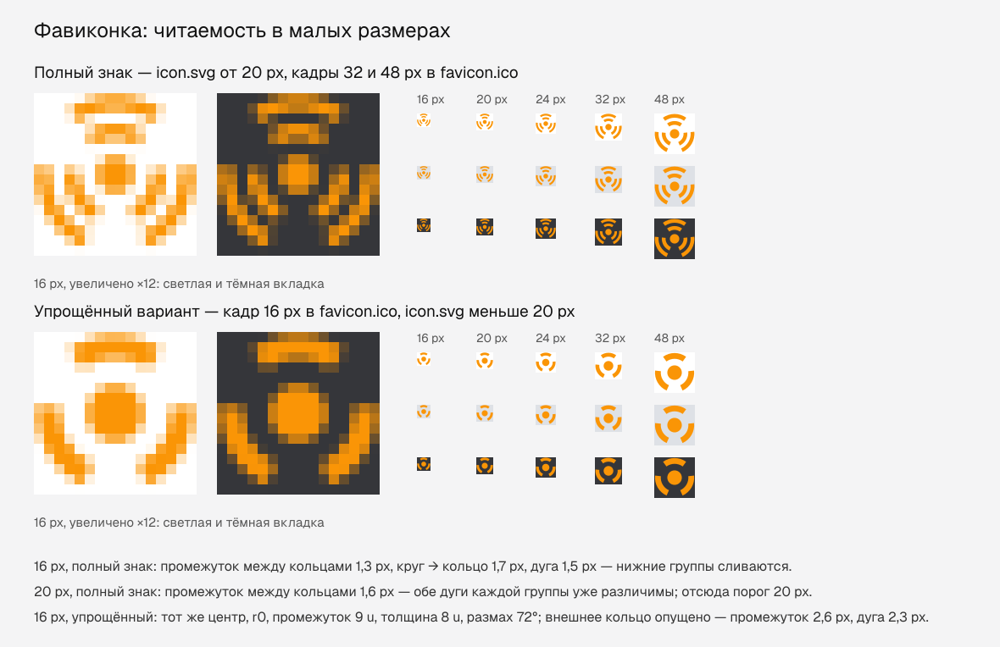

# Логотип: перестройка знака

Задача — antennas.md §9: перестроить знак математически, чтобы круг и все дуги имели один центр.
Знак тот же: оранжевый круг и три группы по две дуги (вверх, вниз-вправо, вниз-влево). Его
геометрия теперь задана восемью числами в `scripts/build-logo.mjs`, а все файлы знака
генерируются из них командой `npm run logo`.



## 1. Что было не так в исходнике

Исходник — `source/logo-original.pdf`, экспорт из Photoshop. Векторных контуров в нём нет: страница
состоит из картинки 4600×4600 и маски прозрачности. `scripts/extract-logo-raster.mjs` достаёт
картинку без потерь (поток FlateDecode, без перерисовки) в `source/derived/logo-original-4600.png`.
`scripts/measure-logo.mjs` измеряет по ней круг (подгонка окружности методом наименьших квадратов),
каждую из 12 кромок дуг (своя окружность для каждой кромки) и 12 торцов (прямые). Результат —
`docs/logo-measurements.json`.

| Что измерено                     | Исходник                                                                 |
| -------------------------------- | ------------------------------------------------------------------------ |
| Круг                             | центр C0 = (2294,3; 2335,2) px, r = 349,1 px; СКО 0,24 px — круг точный  |
| Кромки дуг                       | каждая — чистая окружность (СКО своей подгонки 0,45–0,68 px)             |
| **Центры дуг**                   | **в 364–472 px от центра круга** (в среднем 418 px, 104–135 % его радиуса) |
| Радиусы кромок «от своих центров» | 1107 / 1394 px (кольцо 1), 1564 / 1859 px (кольцо 2)                     |
| Если принудить общий центр       | СКО вырастает с ~0,5 до 17 px (максимум 48 px)                           |
| Торцы                            | не радиальны: отклонение 3,7–8,8° (среднее 6,1°), прямая торца проходит в 90–129 px от C0 |
| Оси групп                        | 1,12°; 121,44°; 239,36° (вместо 0/120/240)                               |
| Размах дуг (по средней линии)    | кольцо 1 — 75,0–76,4°, кольцо 2 — 68,8–69,6°                              |
| Промежутки между группами        | кольцо 1 — 42,8–46,1°, кольцо 2 — 49,2–52,5°                              |

Итог: дуги построены не от центра круга, а от точек, сдвинутых на 1,04–1,35 радиуса круга вдоль оси
своей группы (у верхней группы — на 380–470 px ниже центра круга). Поэтому дуги площе, чем должны быть при общем
центре, «съезжают» относительно круга, а торцы срезаны под случайными углами. На правой панели
картинки выше красные крестики — центры 12 кромок исходника, чёрный — центр круга.

## 2. Цвет

`#FA9506` — доминирующий цвет непрозрачных пикселей исходника. Это гистограмма RGB по пикселям с
альфой 255: 2 638 118 из 2 646 427 пикселей (99,69 %) имеют ровно этот цвет. Следующие по частоте —
`#FA9505` (0,056 %) и `#FB9505` (0,044 %), это шум сжатия и сглаживания. Полупрозрачные краевые
пиксели исключены: в PDF они смешаны с белым фоном (`/Matte`).

В PDF нет ICC-профиля (`/DeviceRGB`), поэтому HEX — это значения RGB, записанные в файл. Браузер
трактует их как sRGB.

## 3. Принцип построения



- **Один центр C** для круга и всех шести дуг.
- Каждая дуга — **кольцевой сектор**: внутренняя и внешняя кромки — окружности с центром C,
  торцы — **радиальные** отрезки (лежат на лучах из C). У обеих дуг одной группы торцы лежат на
  общих лучах. Так было задумано и в исходнике: там торцы внутренней и внешней дуги лежат на одной
  прямой (расхождение ≤ 0,12°, ≤ 1,2 px), только эта прямая проходила мимо центра.
- **Три группы с осями 0°, 120°, 240°**: соответствующие дуги всех групп одинаковые (радиусы,
  толщина, размах).
- Модуль u — 1 единица viewBox, равен 1/8 толщины дуги. Тогда все радиусы — целые числа.
  1 u = 35,50 px исходника (масштаб подобран по пяти радиусам методом наименьших квадратов).

### Измерения и выбранные параметры

| Параметр                             | Исходник, px | Исходник, u | Принято        |
| ------------------------------------ | -----------: | ----------: | -------------- |
| Радиус круга r0                      |        349,1 |        9,83 | **10 u**       |
| Кольцо 1, внутренняя кромка r1i      |        670,6 |       18,89 | **19 u**       |
| Кольцо 1, внешняя кромка r1o         |        953,8 |       26,87 | **27 u**       |
| Кольцо 2, внутренняя кромка r2i      |       1212,1 |       34,15 | **34 u**       |
| Кольцо 2, внешняя кромка r2o         |       1492,9 |       42,06 | **42 u**       |
| Толщина кольца 1 / кольца 2          | 283,2 / 280,8 | 7,98 / 7,91 | **8 u** у обоих |
| Промежуток круг → кольцо 1 (g0)      |        321,5 |        9,06 | **9 u**        |
| Промежуток кольцо 1 → кольцо 2 (g1)  |        258,3 |        7,28 | **7 u**        |
| Размах группы                        | 75,5° / 69,1° по средней линии; 70,5–71,2° по радиальным лучам | — | **72°** у обоих колец |
| Промежуток между группами            | 42,8–52,5°, среднее 47,7°                                  | — | **48°**        |
| Оси групп                            | 1,12°; 121,44°; 239,36°                                    | — | **0°; 120°; 240°** |
| Торцы                                | отклонение от радиального 3,7–8,8°                         | — | **радиальные** |
| Центры дуг относительно центра круга | 364–472 px                                                 | 10,3–13,3 u | **совпадают** |
| Цвет                                 | `#FA9506` (99,69 % пикселей)                               | — | **`#FA9506`**  |

Радиусы исходника в таблице — средние расстояния точек каждой кромки от центра круга C0. Кромки не
концентричны, поэтому это усреднение: так их удобнее сравнивать с новым знаком.
Размах 72° выбран так. Радиальные лучи, ближайшие к торцам исходника, дают 70,5–71,2°. Среднее
размахов двух колец по средней линии — 72,3°. При 72° промежуток между группами — 48°, и размах
с промежутком соотносятся как 3 : 2.

Итоговый viewBox основного знака — `0 0 84 80.3689092`, C = (42; 42). Он плотный: совпадает с
габаритом контура (низ знака — концы нижних дуг на азимутах 156° и 204°).

## 4. Фавиконка и малые размеры



**Проблема.** Во вкладке браузера иконка занимает 16 px. На такой размер приходится 86 u, то есть
1 u ≈ 0,19 px. Промежуток между кольцами — 1,3 px, между кругом и кольцом — 1,7 px, дуга — 1,5 px.
После сглаживания нижние группы сливаются в пятно. При 20 px промежуток уже 1,6 px, и обе дуги
каждой группы различимы. При 32 и 48 px полный знак читается уверенно.

**Сравнённые кандидаты для 16 px.** Все отрендерены sharp и просмотрены с увеличением ×12 и 1:1 на
светлом, сером и тёмном фоне вкладки:

| Кандидат                                                    | Итог                                                    |
| ----------------------------------------------------------- | ------------------------------------------------------- |
| Полный знак (с полем 1 u и без поля)                        | промежутки 1,3–1,7 px сливаются                         |
| Оба кольца с радиусами по пиксельной сетке (2 / 3–5 / 6–8 px) | промежутки 1 px — та же каша                            |
| Толстое одно кольцо (r0 3 px, кольцо 5–8 px)                | читается, но похоже на знак радиационной опасности, а §9 запрещает подменять символ |
| Только внешнее кольцо                                       | дуги 1,5 px, знак «пустой»                              |
| **Круг + внутреннее кольцо с теми же параметрами**          | **читается**: промежуток 2,6 px, дуга 2,3 px, круг ⌀ 5,7 px |

**Решение.** Для размеров меньше 20 px используется упрощённый вариант: тот же центр C, тот же
r0 = 10, то же кольцо 19–27 u, тот же размах 72° и те же оси; внешнее кольцо опущено. Вариант
строит тот же генератор (`SMALL_RINGS` в `build-logo.mjs`), ручных правок нет. `verify-logo`
проверяет, что его круг и секторы в точности совпадают с полным знаком.

| Файл                           | Что внутри                                                                   |
| ------------------------------ | ---------------------------------------------------------------------------- |
| `src/app/favicon.ico`          | кадр 16 px — упрощённый; кадры 32 и 48 px — полный знак                      |
| `src/app/icon.svg`             | полный знак; если иконку рисуют меньше 20 px, `@media (max-width: 19.98px)` внутри SVG переключает её на упрощённый |
| `src/app/apple-icon.png`       | 180×180, полный знак на белом фоне (iOS не любит прозрачность)              |
| `public/brand/logo-mark-16.png` | упрощённый вариант (правило «меньше 20 px» действует для всех растров)      |
| `public/brand/logo-mark-small.svg` | упрощённый вариант вектором, с плотным viewBox                          |

Как устроен `icon.svg`. Упрощённый вариант лежит во вложенном `<svg>` с атрибутом
`display="none"`. Медиазапрос внутри SVG-картинки считается по её собственному размеру. Если
браузер или программа не поддерживает CSS в SVG, показывается полный знак. librsvg (sharp)
`@media` игнорирует — тоже полный знак.

Next.js сам подключает `favicon.ico`, `icon.svg` и `apple-icon.png` из `src/app` по соглашению
о файлах. Для обоих файлов он выводит `<link rel="icon" … sizes="any">`. Какой из них возьмёт
браузер, зависит от браузера, но в 16 px оба дают упрощённый вариант.

**Что проверено.** Chromium 151 (headless shell, ``): при 16 и 19 CSS px
показывается упрощённый вариант, при 20, 24, 32 и 48 px — полный. Результат одинаковый при DPR 1
и 2. **Не проверено**: настоящая вкладка в браузере с полосой вкладок — у headless её нет. На
экранах с DPR 2 браузер может нарисовать `icon.svg` во вкладке и полным знаком (32 физических px),
и упрощённым (16 CSS px). Оба варианта читаются.

## 5. Файлы

| Файл                                             | Назначение                                                      |
| ------------------------------------------------ | --------------------------------------------------------------- |
| `scripts/extract-logo-raster.mjs`                | PDF → `source/derived/logo-original-4600.png` (без потерь)      |
| `scripts/measure-logo.mjs`                       | замеры исходника → `docs/logo-measurements.json`                |
| `scripts/build-logo.mjs`                         | **параметры знака** и генерация всех файлов ниже                |
| `scripts/verify-logo.mjs`                        | программная проверка готовых SVG                                |
| `public/brand/logo-mark.svg`                     | основной знак, `#FA9506`, прозрачный фон, плотный viewBox       |
| `public/brand/logo-mark-mono-dark.svg`           | однотонный `#111111` (печать, однотонные поверхности)           |
| `public/brand/logo-mark-small.svg`               | упрощённый вариант для размеров меньше 20 px                    |
| `public/brand/logo-mark-{1024,512,256,64,32,16}.png` | PNG-превью, прозрачный фон (16 px — упрощённый вариант)     |
| `src/components/brand/logo-geometry.generated.ts` | viewBox, path, центр, цвета и параметры для React (не править вручную) |
| `src/components/brand/LogoMark.tsx`              | серверный React-компонент знака                                 |
| `src/app/icon.svg`, `favicon.ico`, `apple-icon.png` | иконки сайта (см. раздел 4)                                  |
| `docs/logo/before-after.png`                     | сравнение «до / после» с наложением                             |
| `docs/logo/construction.svg`, `.png`             | схема построения: центр, радиусы, углы                          |
| `docs/logo/favicon-sizes.png`                    | полный и упрощённый варианты в малых размерах                   |
| `docs/logo-measurements.json`                    | все замеры исходника                                            |

Исходный PDF не тронут: `source/logo-original.pdf`.

### Компонент для разработчиков

```tsx
import { LogoMark } from '@/components/brand/LogoMark';

<LogoMark size={32} />                        // декоративный: имя даёт ссылка или текст рядом
<LogoMark size="2.5rem" title="Логотип" />    // самостоятельная картинка: role="img" + <title>
<LogoMark className="h-8 w-auto" tone="mono" /> // размер классами, тёмный однотонный
```

`size` задаёт высоту: число — в px, строка — любая CSS-длина. По умолчанию `1em`. Ширина
вычисляется из пропорций. Размер записывается атрибутами SVG, поэтому классы его переопределяют.
`useId` даёт уникальный id для `<title>`, даже если знаков на странице несколько. В Chromium
проверено: `size={40}` → 41,8×40, `'2rem'` → 33,4×32, класс `height: 64px` → 66,9×64.

## 6. Как пересобрать и проверить

```bash
node scripts/extract-logo-raster.mjs   # только если заменили PDF
node scripts/measure-logo.mjs          # только если заменили PDF
npm run logo                           # генерация всех файлов знака
node scripts/verify-logo.mjs           # проверка геометрии; код выхода 1 при FAIL
```

Чтобы поменять знак, правьте константы в начале `scripts/build-logo.mjs`, затем выполните
`npm run logo` и `verify-logo`.

`verify-logo` разбирает готовые SVG (`logo-mark.svg`, `-mono-dark`, `-small`, `src/app/icon.svg`),
а не генератор. Что он проверяет:

- центр каждой команды `A` вычисляется из концов, радиуса и флагов (SVG 1.1, F.6.5) и совпадает
  с центром круга с допуском 1·10⁻⁶ u;
- хорды не длиннее 2r;
- торцы радиальны;
- соответствующие дуги трёх групп одинаковые;
- оси групп идут через 120°;
- в файлах нет `<image>`, base64, `data:` и ссылок;
- viewBox плотный;
- цвет равен измеренному;
- `icon.svg`: упрощённый вариант совпадает с полным без внешнего кольца, без CSS виден полный знак;
- сгенерированный TS совпадает с `logo-mark.svg`, кадры `favicon.ico` — PNG нужных размеров.

Фактический результат: **PASS, 97 проверок**. Максимальное отклонение центра дуги — 7,6·10⁻⁸ u,
прямой торца от C — 2,0·10⁻⁷ u. Это ошибка округления координат до 7 знаков.

Проверка ловит дефекты. На испорченных копиях `logo-mark.svg` скрипт выдаёт FAIL с кодом выхода 1:

- радиус одной дуги 27 → 27,5;
- один сектор сдвинут на 0,5 u — как «вручную сдвинутая кривая» в исходнике;
- встроен `<image>` с base64;
- viewBox с лишним полем;
- оси 0/125/245°.

**Детерминизм.** Два прогона `npm run logo` подряд, первый с пустым кэшем fontconfig, дают
побайтно одинаковые выходы: совпадают sha256 всех 17 файлов. Проверено на sharp 0.35.5 (libvips
8.18.7, librsvg 2.63.2). На других версиях этих библиотек PNG могут отличаться в пикселях
сглаживания. SVG и TS от них не зависят.

Подписи на схемах растеризуются шрифтом Geist из пакета `next`: генератор сам подключает его
через отдельный `fonts.conf`, системные шрифты не нужны.

## 7. Открытые вопросы

1. **Шапка сайта.** `LogoMark` готов, но в шапку пока не подключён (§9.8). Это работа над
   раскладкой, она вне файлов знака.
2. **Упрощённый вариант для 16 px** — производная от знака. Его стоит показать заказчику вместе
   с `docs/logo/favicon-sizes.png`.
3. **Цвет.** В PDF нет цветового профиля. Если есть брендбук или исходный PSD с HEX/Pantone,
   сверить с ним `#FA9506`.
4. **Название бренда** не подтверждено, поэтому доступное имя знака нейтральное — «Логотип»
   (`TITLE` в `build-logo.mjs`). После подтверждения названия поменять его там и в `title`
   у `LogoMark`.
5. **Вкладка в настоящем браузере** не проверена (см. раздел 4).
6. В `package.json` нет скрипта для `verify-logo`. Можно добавить, например, `"logo:verify"`.
